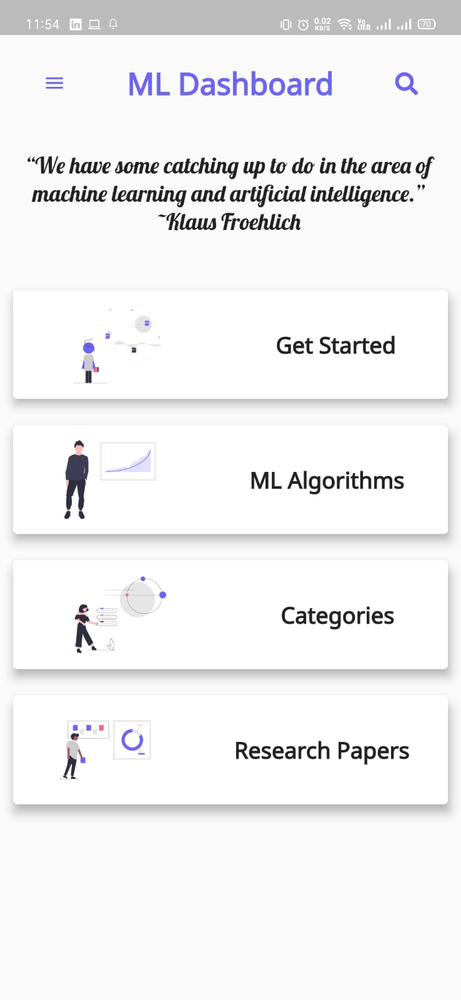
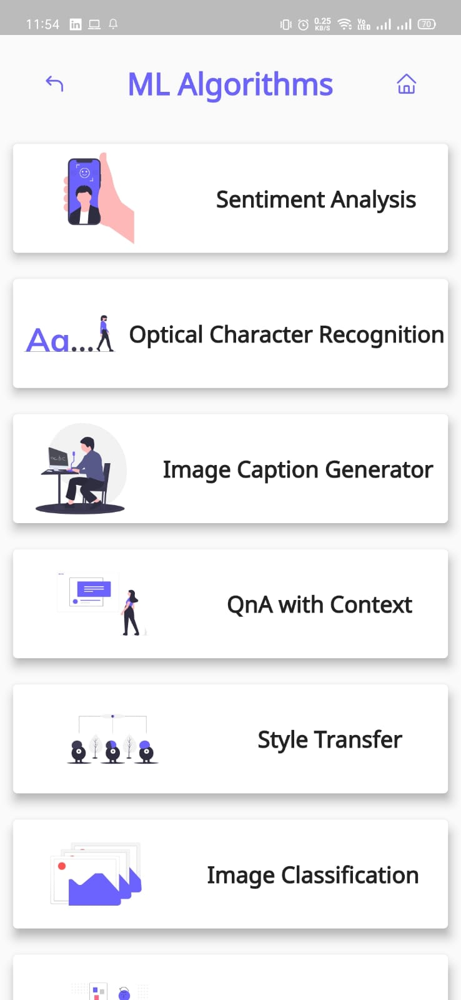
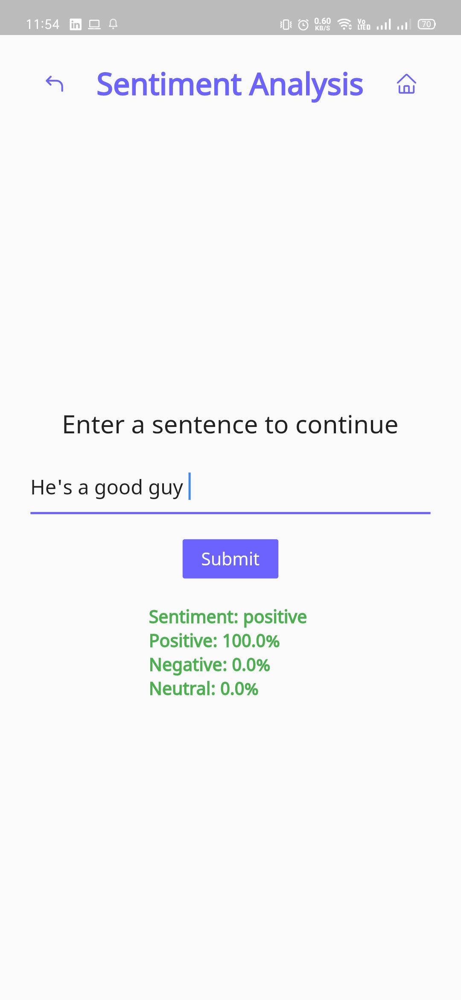
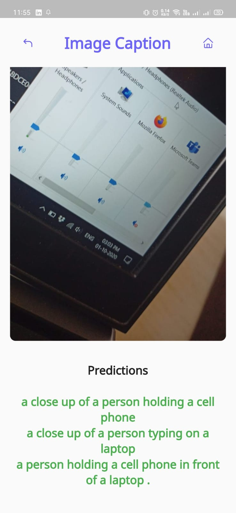
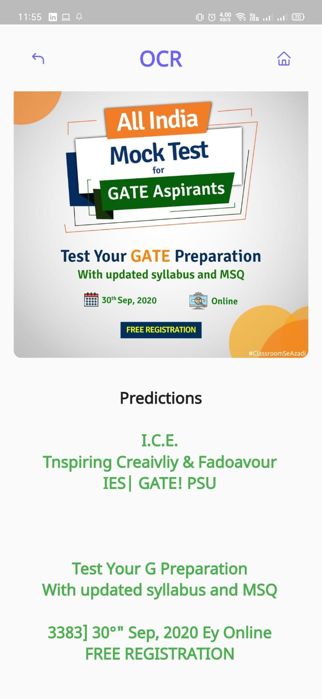
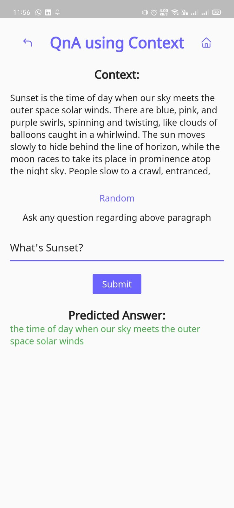
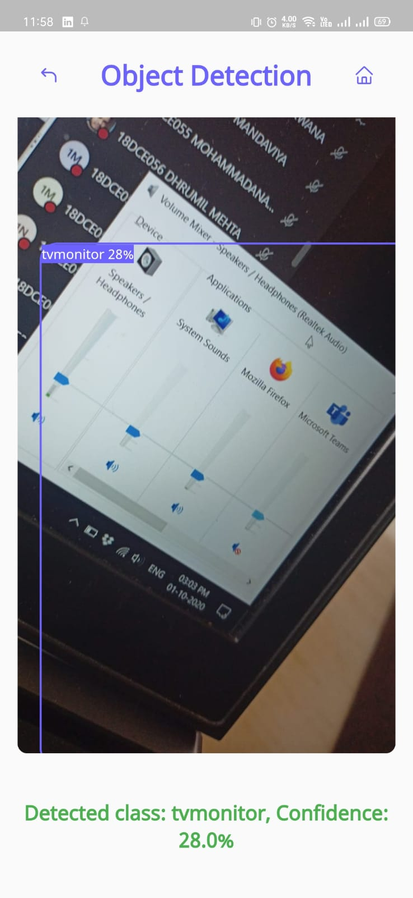
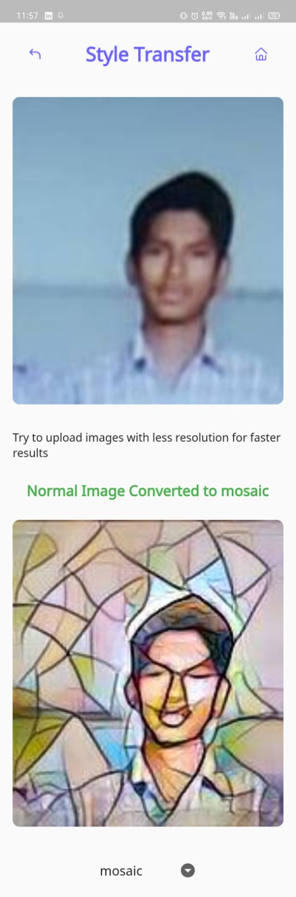
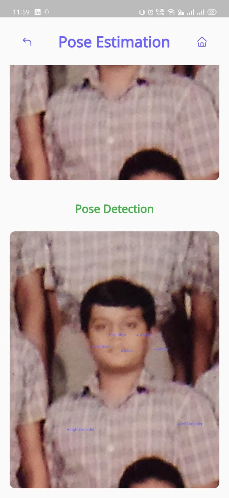
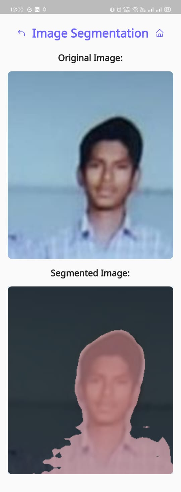

# ML Examples

#### Material Design Application which will help you to get started with ML and In App examples of some Algorithms.

[Download APK](https://drive.google.com/file/d/1SsCcWyTNY5xQjcZIOGGib2bnLh-6BHuq/view?usp=sharing)

### Some Screenshots:

**Dashboard**

**ML Algorithms**

**Sentiment Analysis**

**Generate Caption from Image**

**OCR**

**QnA based upon given Context**

**Object Detection using Yolo (TFLite)**

**StyleTransfer**

**Pose Estimation using Posenet (TFLite)**

**Image Segmentation using Deeplab (TFLite)**

### TODOs

- [ ] Complete Search Option
- [ ] Add research APIs (_maybe create an API ?!_)
- [ ] Add more stuff in get started
- [ ] Add More Categories
- [ ] Refine Web App
- [ ] Try calling ml5.js Models using JS Channels (**_This is gonna be challenging_**)

#### APIs used

[IBM Models](https://developer.ibm.com/exchanges/models/all/)

- OCR
- Image Caption Generation
- Style Transfer
- Question Answering

[Rapid API (Sentiment Analysis)](https://developer.ibm.com/exchanges/models/all/)

- Sentiment Analysis

#### Models used

[TFLite Models](https://www.tensorflow.org/lite/models)

- Deeplab
- Mobilenet
- Posenet
- Yolo

#### Developed with Flutter and Getx

[Flutter](https://flutter.dev)

[Getx](https://github.com/jonataslaw/getx)

[Webapp (WIP)](https://madhavtripathi05.github.io/ml_examples)
